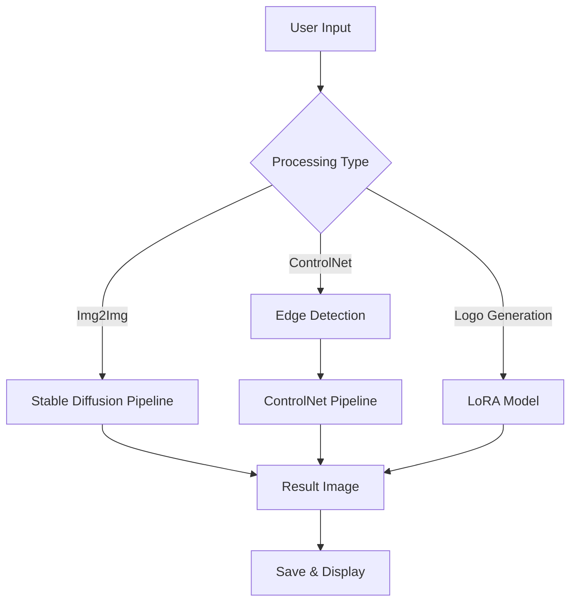

# AI Image Processing and Logo Generation System
## Project Report

---

## Table of Contents
1. [Introduction](#introduction)
   - Background and Context
   - Problem Statement
   - Project Objectives
   - Scope of the Project
2. [Design of the Project](#design-of-the-project)
   - System Architecture
   - Flowchart
   - Technologies Used
3. [Implementation](#implementation)
   - Core Components
   - Model Integration
   - User Interface
4. [Results and Discussion](#results-and-discussion)
   - Output Examples
   - Performance Analysis
5. [Conclusion](#conclusion)
   - Summary
   - Future Work and Recommendations
6. [References](#references)

---

## Introduction

### Background and Context
The project implements an advanced AI-powered image processing system that combines multiple state-of-the-art models for image transformation and logo generation. The system leverages Stable Diffusion models, ControlNet, and custom LoRA models to provide a comprehensive suite of image processing capabilities.

### Problem Statement
Traditional image processing and logo generation often require significant manual effort and expertise. The challenge was to create an accessible, efficient, and versatile system that could:
- Transform images while preserving their structural elements
- Generate high-quality logos with specific styles
- Provide an intuitive user interface for non-technical users
- Handle multiple processing pipelines efficiently

### Project Objectives
1. Develop a web-based interface for image processing and logo generation
2. Integrate multiple AI models for different processing capabilities
3. Implement efficient memory management for model loading
4. Create a user-friendly system for image transformation
5. Enable logo generation with specific style controls

### Scope of the Project
The project encompasses:
- Image-to-image transformation
- ControlNet-based edge detection and processing
- Logo generation using custom LoRA models
- Web interface development
- Memory optimization and resource management

---

## Design of the Project

### System Architecture
The system is built using a Flask-based web application with the following components:
- Frontend: HTML/CSS/JavaScript
- Backend: Python/Flask
- AI Models: Stable Diffusion, ControlNet, LoRA
- Image Processing: PIL, OpenCV

### Flowchart


### Technologies Used
1. **AI Models**:
   - Stable Diffusion v1.5
   - ControlNet (Canny Edge Detection)
   - Logo.Redmond LoRA Model

2. **Web Framework**:
   - Flask
   - HTML5/CSS3
   - JavaScript

3. **Image Processing**:
   - PIL (Python Imaging Library)
   - OpenCV
   - Safetensors

---

## Implementation

### Core Components

1. **Image Processing Pipeline**
```python
def load_img2img_pipeline():
    pipe = StableDiffusionImg2ImgPipeline.from_pretrained(
        "runwayml/stable-diffusion-v1-5",
        torch_dtype=dtype,
        cache_dir=local_cache
    ).to(device)
    pipe.enable_attention_slicing()
    return pipe
```

2. **Logo Generation**
```python
def load_logo_lora_pipeline():
    pipeline = StableDiffusionPipeline.from_pretrained(
        "runwayml/stable-diffusion-v1-5",
        torch_dtype=dtype,
        cache_dir=local_cache
    ).to(device)
    
    lora_path = "lora_models/LogoRedmond15V-LogoRedmAF-Logo.safetensors"
    if os.path.exists(lora_path):
        state_dict = load_file(lora_path)
        pipeline.unet.load_state_dict(state_dict, strict=False)
    return pipeline
```

### User Interface
The interface provides three main processing options:
1. Img2Img Transformation
2. Full Pipeline (Img2Img + ControlNet)
3. Logo Generation

Features:
- Dark mode theme
- Real-time processing status
- Image preview and download
- Latest image reuse functionality

---

## Results and Discussion

### Output Examples
The system successfully generates:
1. Transformed images with preserved structure
2. Edge-detected and enhanced images
3. Custom logos with specified styles

### Performance Analysis
- Memory-efficient model loading
- On-demand pipeline initialization
- Automatic resource cleanup
- Support for both CPU and GPU processing

---

## Conclusion

### Summary
The project successfully implements a comprehensive image processing system that combines multiple AI models for various image transformation tasks. The system provides an intuitive interface for users to process images and generate logos with specific styles.

### Future Work and Recommendations
1. **Model Improvements**:
   - Integration of additional LoRA models
   - Support for more ControlNet variants
   - Implementation of model quantization

2. **Feature Enhancements**:
   - Batch processing capability
   - Advanced style controls
   - Custom model training interface

3. **Performance Optimizations**:
   - Caching mechanisms
   - Distributed processing
   - GPU memory optimization

---

## References

1. Stable Diffusion Documentation
   - https://huggingface.co/docs/diffusers/index

2. ControlNet Paper
   - Zhang, L., & Agrawala, M. (2023). Adding Conditional Control to Text-to-Image Diffusion Models

3. LoRA: Low-Rank Adaptation
   - Hu, E. J., et al. (2021). LoRA: Low-Rank Adaptation of Large Language Models

4. Flask Documentation
   - https://flask.palletsprojects.com/

5. Safetensors Documentation
   - https://huggingface.co/docs/safetensors/ 
